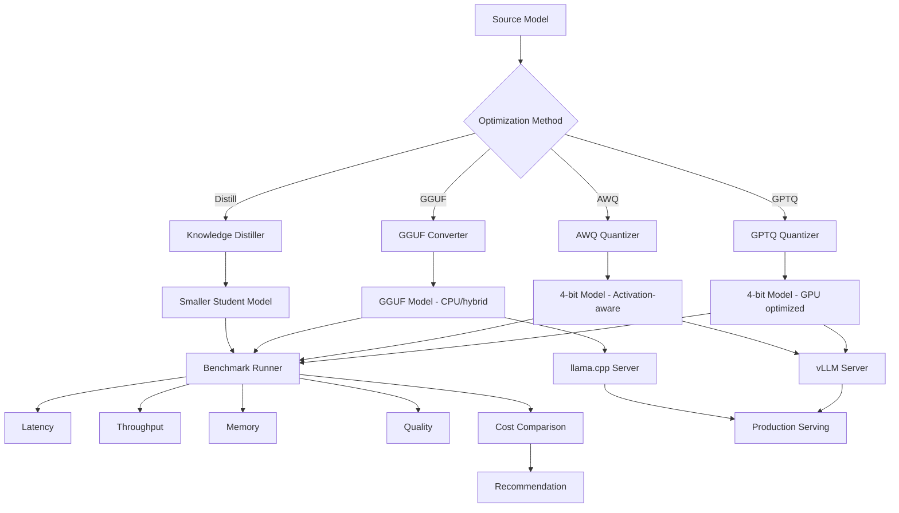

# AI GenAI Model Optimization

LLM optimization framework with GPTQ/AWQ/GGUF quantization, knowledge distillation, speculative decoding, and production serving with vLLM.

## Objectives

- Understand post-training quantization techniques (GPTQ, AWQ) and how they reduce model size while preserving quality
- Apply activation-aware weight quantization (AWQ) to achieve optimal compression with minimal accuracy loss
- Convert transformer models to GGUF format for efficient CPU and hybrid CPU/GPU inference using llama.cpp
- Implement knowledge distillation pipelines to transfer capabilities from large teacher models to smaller student models
- Benchmark and compare inference latency, throughput, memory footprint, and output quality across optimization methods
- Deploy quantized LLMs in production using vLLM with continuous batching and PagedAttention for high-throughput serving
- Design cost-optimization strategies by selecting the right quantization method based on hardware constraints and quality requirements
- Build REST APIs around optimized models with FastAPI, supporting multiple quantization backends behind a unified interface
- Evaluate trade-offs between model compression ratio, inference speed, and generation quality for real-world deployment decisions
- Containerize and orchestrate optimized model serving with Docker for reproducible, scalable production environments

## Table of Contents
1. [Overview](#overview)
2. [Project Structure](#project-structure)
3. [Optimization Methods](#optimization-methods)
4. [Deployment](#deployment)
5. [API Reference](#api-reference)
6. [Testing](#testing)

---

## End-to-End Flow



---

## Optimization Methods

| Method | Compression | Quality | Best For |
|--------|-------------|---------|----------|
| GPTQ | ~4x (4-bit) | High | GPU inference, batch processing |
| AWQ | ~4x (4-bit) | Highest | GPU inference, quality-sensitive |
| GGUF Q4_K_M | ~4x | Good | CPU/hybrid, local deployment |
| GGUF Q8_0 | ~2x | Excellent | CPU with quality priority |
| Distillation | Model-dependent | Varies | Custom smaller models |

---

## Project Structure

```
ai-genai-model-optimization/
├── src/model_optimization/
│   ├── quantization/
│   │   ├── gptq_quantizer.py    # GPTQ 4-bit quantization
│   │   ├── awq_quantizer.py     # AWQ activation-aware quantization
│   │   └── gguf_converter.py    # GGUF format for llama.cpp
│   ├── distillation/distiller.py # Knowledge distillation
│   ├── serving/vllm_server.py   # vLLM production deployment
│   ├── benchmarks/runner.py     # Performance comparison
│   ├── api/router.py
│   └── main.py
├── tests/
├── config/
├── pyproject.toml, Dockerfile, docker-compose.yml
```

---

## Deployment

```bash
poetry install && cp .env.example .env
poetry run python -m uvicorn model_optimization.main:app --reload --port 8000
poetry run pytest
docker-compose up --build
```

---

## API Reference

| Endpoint | Description |
|----------|-------------|
| POST /api/v1/optimization/quantize/gptq | GPTQ quantization |
| POST /api/v1/optimization/quantize/awq | AWQ quantization |
| POST /api/v1/optimization/quantize/gguf | GGUF conversion |
| GET /api/v1/optimization/quantize/gguf/types | List GGUF types |
| POST /api/v1/optimization/distill | Knowledge distillation |
| POST /api/v1/optimization/serve/config | vLLM config |
| GET /api/v1/optimization/benchmarks/compare | Compare models |

---

## Testing

```bash
poetry run pytest --cov=src/model_optimization --cov-report=term-missing
```
